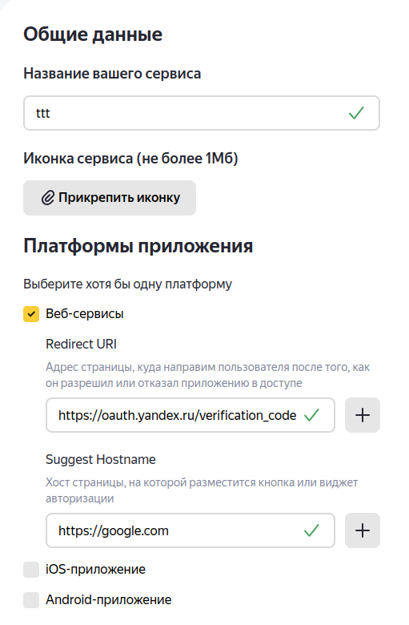
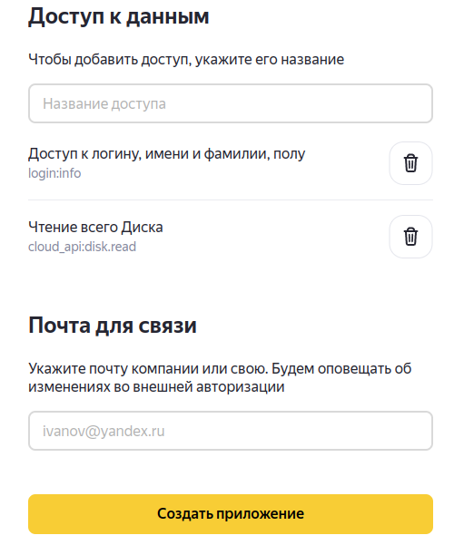
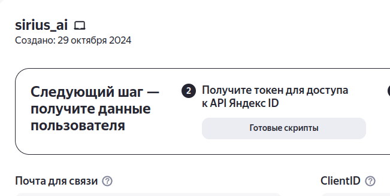
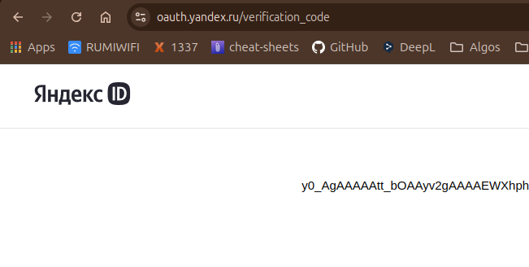

# Как скачать видео с Я.Диска
Документация: https://yandex.ru/dev/disk-api/doc/ru/concepts/quickstart

## 1. Получить ключ OAuth
Откройте страницу создания приложения (https://oauth.yandex.ru/client/new/)

Пропишите cloud_api:disk.read в названии доступа.

Нажмите создать приложение.

В новом окне найдите токен ClientID.

В браузере отправьте запрос на этот URL, <ClinetID> замените на ваш.

`https://oauth.yandex.ru/authorize?response_type=token&client_id=<ClientID>`

В открывшемся окне будет OAuth токен (Вставьте его вместо переменной `oauth_token` в jupyter notebook)

Откройте видео в своем я.диске. Скопируйте последнюю часть URL по примеру:

Копируйте начиная с `%2fФотокамера....`. (Вставьте его вместо переменной `file_path` в jupyter notebook)

Запустите `example.ipynb` с вашими OAuth токеном и путем до видео файла на диске.

Готово :)
